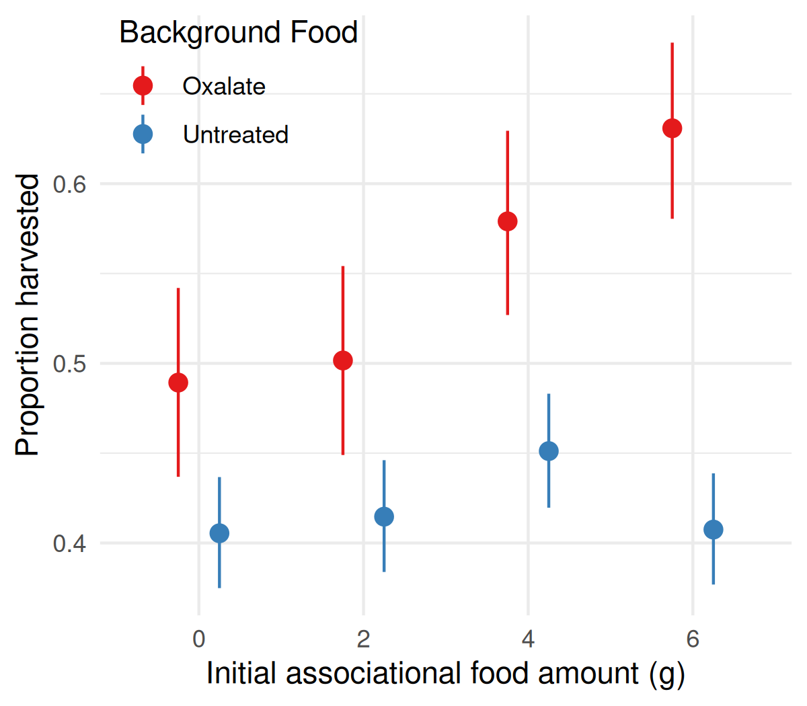
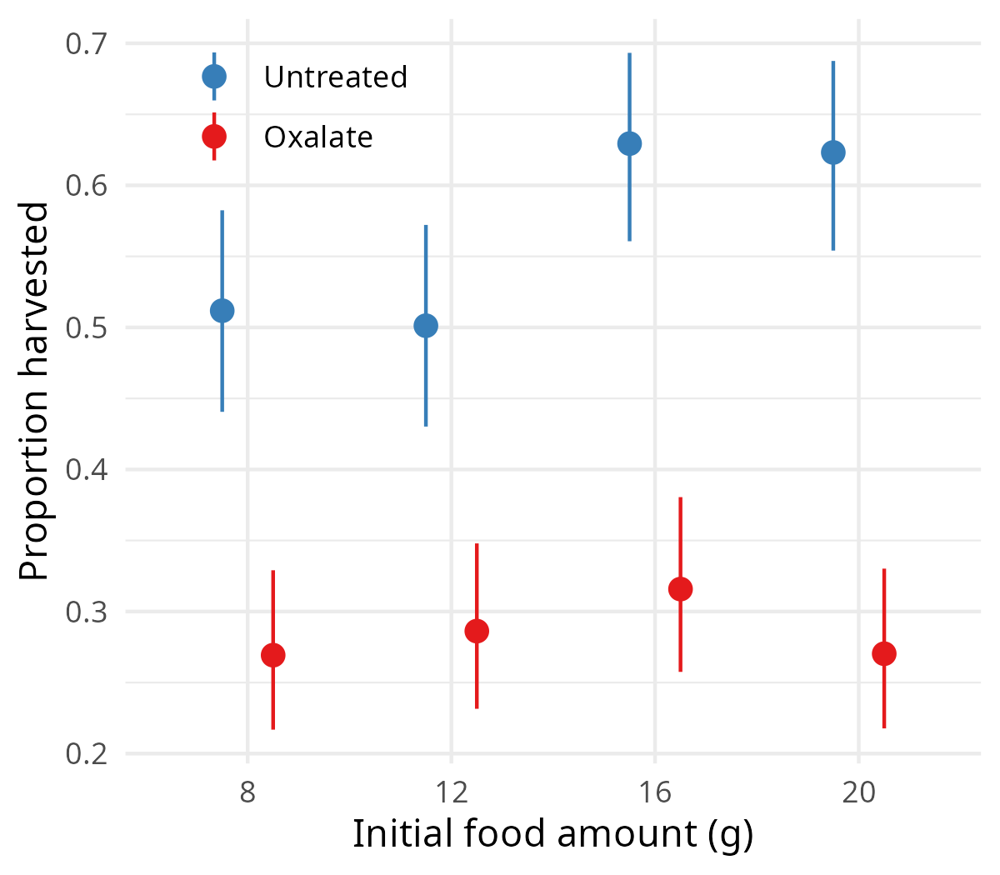
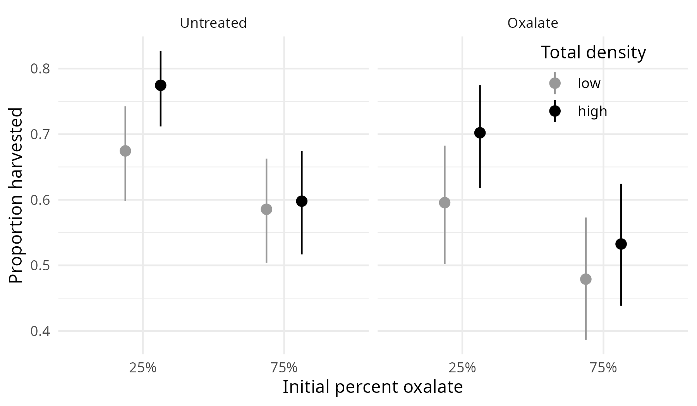
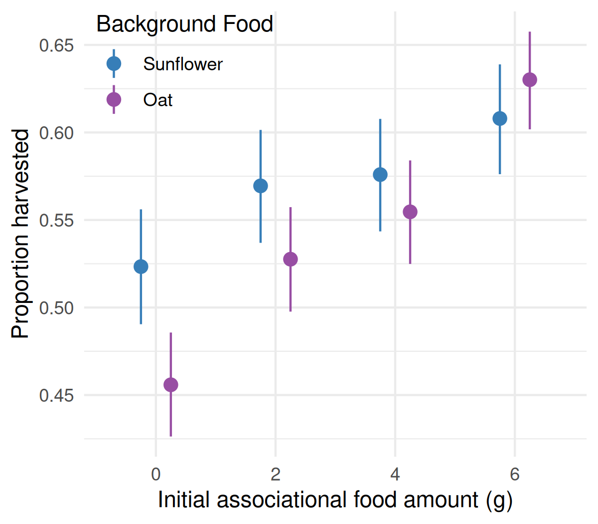
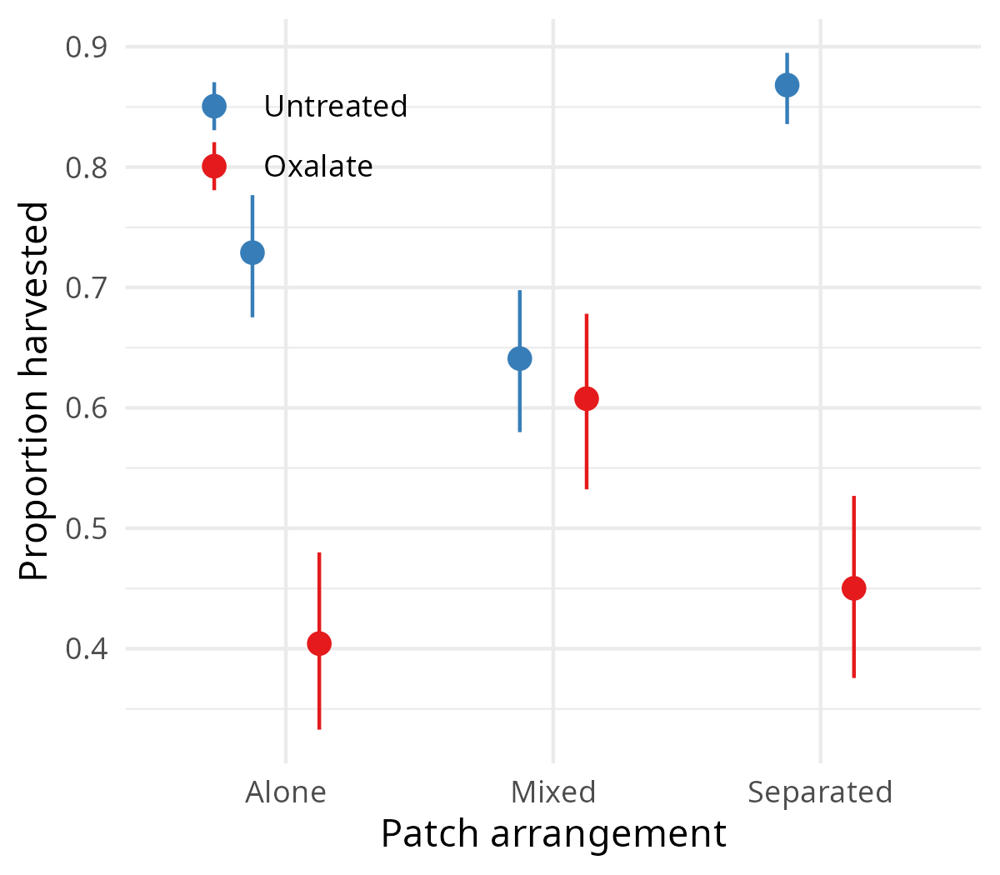
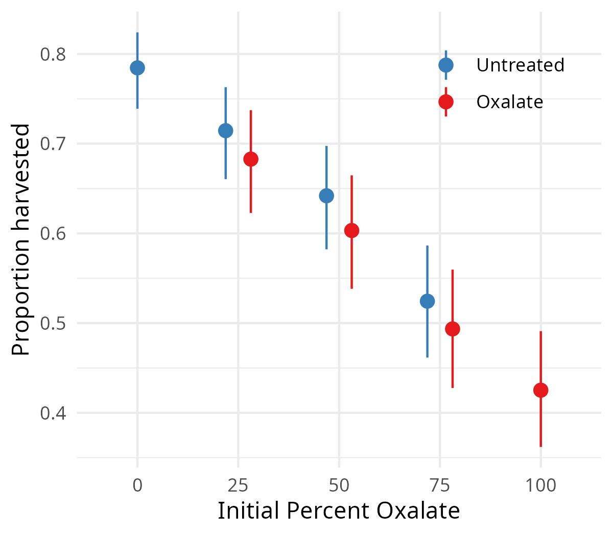

# Associational effects in a seed-tray foraging system

Unpublished data and R code from a series of foraging experiments I ran during graduate school at Texas Tech (October 2006 – April 2007). The experiments asked whether a food item's survival depends on its neighbors: does a palatable seed survive better when it is surrounded by unpalatable seeds (*associational refuge*), and does an unpalatable seed fare worse when surrounded by palatable seeds (*shared doom*)?

I never wrote these results up for a journal (see [Caveats](#caveats)), but there is a reasonably coherent story in them, which I've tried to tell here.

## Background

### Study site and foragers

The experiments were run at the Native Rangeland Teaching and Research Area in Lubbock, Texas. The site is about 60 ha of shortgrass prairie dominated by blue grama and buffalo grass, with scattered mesquite. Cottontails (*Sylvilagus* spp.) are abundant there, while small mammals are otherwise neither abundant nor diverse.

Rabbits were often seen foraging in the trays and readily ate the seeds, even though they are herbivores. Hispid cotton rats also foraged from trays at the site. They seemed to stay close to their burrows, so trays were placed away from rodent burrows and runways. See [Caveats](#caveats).

### Methods

Each food patch was a plastic nursery tray (56 × 28 × 7 cm) holding 3.8 L of sand, with a known mass of husked sunflower seeds mixed in. Trays were set out after sunset and collected before sunrise. The remaining seeds were then sifted from the sand, cleaned, sorted by type, and weighed to the nearest 0.01 g. That remaining amount is the giving-up density (GUD).

Seeds were either *untreated* (palatable) or *oxalate*. Oxalate seeds were soaked for 2 hours in a 15% (w/v) oxalic acid solution, oven-dried at 65 °C for 2 hours, then air-dried for at least 24 hours, following Schmidt et al. (1998) and Schmidt (2000). The treatment bleaches the seeds, which made the two types easy to tell apart when sorting. One pair of experiments used oats in place of oxalate seeds.

Trays were set side by side at 6–8 stations at least 50 m apart, and each station received the full set of treatments every night. A Latin square randomized which tray got which treatment across the 4–5 nights of each experiment.

The design closely follows [Emerson et al. (2012)](https://doi.org/10.1007/s00442-011-2144-4), who ran similar experiments with fox and gray squirrels in Illinois. My graduate advisor, Ken Schmidt, is a co-author on that paper. Comparing their squirrels with my rabbits is part of what makes these data interesting.

### Analysis

The response variable throughout is the proportion of seeds harvested (1 − GUD / initial amount), analyzed on the logit scale with a random effect of station. My original analysis plan also treated night as a random effect; the current scripts don't. Within-patch selectivity uses Manly's index (`Functions.R`): 0.5 means that seeds were taken in proportion to their availability, and values above 0.5 mean that untreated seeds were preferred.

### Theory

These experiments were framed around a forager with a fixed *quitting harvest rate*: it leaves a patch once its rate of finding food falls to a set threshold. Because that rate depends on how much food is left, such a forager should leave every patch of a given food at the same GUD, whatever the starting amount. So the proportion harvested should rise with the initial amount. If the forager behaves this way for both foods, a neighbor's effect should depend only on how much of each food is in the patch.

## The story

**Bad neighbors are contagious; good neighbors aren't very protective.**

### 1. Shared doom, but no associational refuge

Each tray had 10 g of a background food and 0, 2, 4, or 6 g of an associational food.

- Adding untreated seeds to oxalate trays increased harvest of the oxalate seeds from about 0.49 to 0.63 (p < 0.001). That is shared doom.
- Adding oxalate seeds to untreated trays had no effect on harvest of the untreated seeds, which stayed near 0.41 (p = 0.53). That is no refuge.
- Offering a dish of 12 g of extra oxalate seeds at each station nudged the refuge effect in the predicted direction, but not significantly (p = 0.49).

This is the same asymmetry that Emerson et al. found among patches in their Experiment 2 with squirrels: shared doom for less palatable seeds, no refuge for palatable ones.

### 2. Why the asymmetry: rabbits track the density of good food, not bad food

The patch assessment experiment tested the quitting-harvest-rate prediction directly. Trays held 8, 12, 16, or 20 g of a single food type. Two of the eight stations had almost no foraging and were left out of the data.

- **Untreated seeds:** mean GUD rose from 3.9 to 7.8 g across that range, more slowly than the starting amount. So the proportion harvested rose (about 0.51 → 0.62). That is partway toward the equal GUDs that a fixed quitting harvest rate predicts.
- **Oxalate seeds:** mean GUD rose roughly in step with the starting amount (5.6 → 14.2 g). The proportion harvested stayed flat at about 0.27–0.32, with no sign of a quitting harvest rate at all.

The difference between the two foods is marginal (food × amount interaction, p = 0.07).

If the rabbits judge a patch by how much good food it holds, the asymmetry follows. Adding untreated seeds makes a patch worth working longer, and the oxalate seeds are caught up in that extra effort. Adding oxalate seeds doesn't make the patch any less worth working, so the untreated seeds gain nothing.

The composition × density experiment points the same way. It crossed total amount (8 g vs. 16 g) with oxalate share (25% vs. 75%). If rabbits used a fixed quitting harvest rate for both foods, amount and share should have had independent effects. Instead, doubling the total increased harvest when 25% of the seeds were oxalate, but not when 75% were. The interaction is not significant, so treat this as suggestive.

When the second food is also valuable (oats instead of oxalate seeds), adding it increased harvest of an oat background (p < 0.001). The trend was similar but not significant for a sunflower background (p = 0.14).

### 3. Rabbits can't select within a mixed patch, but they can when the foods are separated

Within mixed trays, rabbits were barely selective: Manly's index was 0.52–0.58 across experiments. The scale experiment (`Scale.R`) put 10 g of each food in a tray, either mixed together or confined to separate halves:

| Arrangement | Untreated harvested | Oxalate harvested | Selectivity |
|---|---|---|---|
| Alone (single food) | 0.73 | 0.40 | — |
| Mixed | 0.64 | 0.61 | 0.53 |
| Separated halves | 0.87 | 0.45 | 0.76 |

I predicted refuge for untreated seeds and shared doom for oxalate seeds in mixed trays. If the rabbits could perceive the split, I expected neither effect in separated trays. That is what happened. Mixing pushes the fates of the two foods together, while separating them lets the rabbits sort the food themselves, and both associational effects disappear.

Emerson et al. predicted that dividing patches into micropatches would increase selectivity. Their squirrels showed this only weakly, while these rabbits show it strongly.

### 4. A design lesson: additive vs. replacement experiments

The experiments above are *additive* designs: the focal food is held constant and the neighbor is added, so total density rises. The replacement series instead held the total at 16 g and varied the oxalate share from 0 to 100%.

In the replacement series, untreated harvest fell from 0.78 to 0.52 as the oxalate share rose, which looks like a strong associational refuge. Oxalate harvest rose from 0.43 alone to 0.68 when oxalate made up only 25% of the seeds, which looks like shared doom. Both trends were significant (p < 0.001).

Hambäck et al. (2014) show that the two designs mix up different things. In an additive design, the neighbor's relative frequency changes along with total density. In a replacement design, it changes along with the focal food's own density. Results from one design therefore can't be compared directly with results from the other. Their models, built for insect herbivores, predict that additive designs tend to show associational resistance. More plants in a patch spread the herbivores more thinly, an effect called *resource dilution*.

A forager that depletes patches doesn't seem to work that way. In the patch assessment experiment, rabbits harvested a *larger* proportion of untreated seeds from richer patches, which is concentration rather than dilution. The proportion harvested didn't change with the amount of oxalate seed. Two consequences follow:

- **Additive design:** adding oxalate neighbors didn't thin out the harvest of untreated seeds, so there was no refuge. Adding untreated neighbors made the patch worth working harder, so there was shared doom.
- **Replacement design:** raising the oxalate share also cuts the untreated amount from 16 g to 4 g. Rabbits harvest a smaller proportion from poorer untreated patches, so much of the apparent refuge could come from the focal food's own density rather than from its neighbors.

The replacement series also shows the pattern Hambäck et al. identify as the most common outcome: the palatable food appears to gain a refuge while the less palatable food suffers shared doom.

## Caveats

These are the reasons I never pursued publication:

1. **Unnatural system.** Seed trays are a standard tool for measuring giving-up densities, but cottontail rabbits harvesting sunflower seeds from sand is not a natural interaction.
2. **Forager identity.** Rabbits were often seen at the trays, and trays were kept away from rodent burrows and runways. Hispid cotton rats did forage in trays at the site, though, and I have no tracks, cameras, or other systematic records to show who did the foraging. If some stations were mostly visited by rats, differences among stations would partly reflect which species was foraging.
3. **Sub-optimal foraging claims.** Any claim that rabbits forage sub-optimally (e.g., non-selectively within patches) runs straight back into caveat 1.
4. **Not a cohesive program.** These were my last experiments at Texas Tech, and I was trying many things to see if the system was viable. Each experiment ran for only 4–5 nights at 6–8 stations, the experiments were spread across different seasons, and comparisons across experiments (e.g., replacement vs. patch assessment) are informal.

## Repository contents

An earlier round of associational refuge and shared doom tests (data not included) found shared doom but no refuge. That raised the question of whether the rabbits were foraging in a density-dependent way at all, which led to the apparent competition and patch assessment experiments. The AR and SD tests in this repository were run again after the apparent competition experiment.

| Experiment | Dates | Data | Script | Figure |
|---|---|---|---|---|
| Apparent competition (oat / sunflower) | Oct–Nov 2006 | `AC_oat_back.csv`, `AC_sun_back.csv` | `ApparentCompetition.R` | `AC.png` |
| Associational refuge | Nov 2006 | `AR.csv` | `AR_SD.R` | `AR_SD.png` |
| Associational refuge + oxalate supplement | Dec 2006 | `AR_ox_supp.csv` | `AR_SD.R` | — |
| Shared doom | Dec 2006 | `SD.csv` | `AR_SD.R` | `AR_SD.png` |
| Scale (mixed vs. separated) | Jan–Feb 2007 | `scale.csv` | `Scale.R` | `Scale.png` |
| Replacement series | Feb 2007 | `replacement.csv` | `Replacement.R` | `Replacement.png` |
| Composition × density | Mar 2007 | `comp_density.csv` | `Comp_Density.R` | `CompDensity.png` |
| Patch assessment | Apr 2007 | `patch_assess.csv` | `PatchAssessment.R` | `PatchAssessment.png` |

`Metadata.pdf` diagrams each experimental design. Scripts are run from the repository root and require `dplyr`, `nlme`, `car`, `ggplot2`, `boot`, `tidyr`, and `AICcmodavg`. The CSV files use old Mac (CR) line endings; `read.csv` handles them fine.

## References

- Emerson SE, Brown JS, Whelan CJ, Schmidt KA (2012) Scale-dependent neighborhood effects: shared doom and associational refuge. *Oecologia* 168:659–670. https://doi.org/10.1007/s00442-011-2144-4
- Hambäck PA, Inouye BD, Andersson P, Underwood N (2014) Effects of plant neighborhoods on plant–herbivore interactions: resource dilution and associational effects. *Ecology* 95:1370–1383.
- Schmidt KA (2000) Interactions between food chemistry and predation risk in fox squirrels. *Ecology* 81:2077–2085.
- Schmidt KA, Brown JS, Morgan RA (1998) Plant defenses as complementary resources: a test with squirrels. *Oikos* 81:130–142.
- Underwood N, Inouye BD, Hambäck PA (2014) A conceptual framework for associational effects: when do neighbors matter and how would we know? *Quarterly Review of Biology* 89:1–19.
